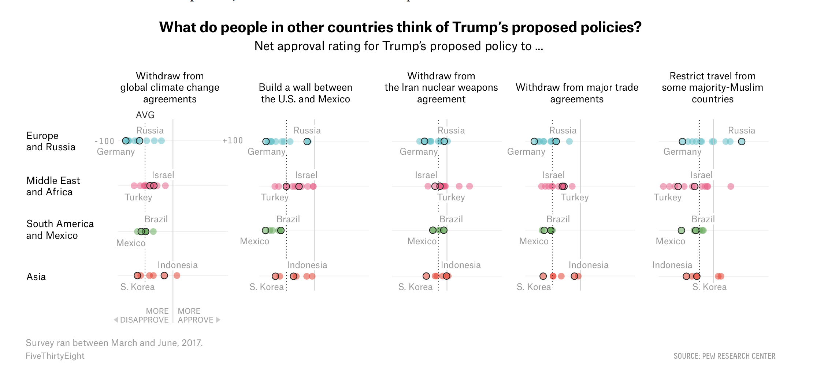

```{r setup, include=FALSE}
knitr::opts_chunk$set(echo = TRUE)
```


```{r }
library(tidyverse)

```
Source: https://fivethirtyeight.com/features/what-the-world-thinks-of-trump/

This graph transmit the truthful information. The authors of the graph showed the source  of the net approval ratings for five proposed  policies from Trump, based on of the data from "Pew Research Center". Additionally, the graph indicates the timing when the survey was done, from March to June of 2017, after three months of the start of Trumps mandate. The analysis of this time frame can be good since exclude the first months in which the excitement of his appointment or the ignorance or lack of communication of his proposals and the time that takes the international media to disseminate the information could had bias the approval rating form one side or to another. Also, since some of this policy initiatives had been promoted during his campaign, it is highly probable that the information about them had been  already spread in the international arena. 

Moreover, since the article that includes this graph was published in September, 2017, the graph offers a very recent information about the international opinion, far from trying to mislead the timing of when the information was extracted from when it was presented.

Additionally, the authors use a spatial distance of points to show the distribution of approval or disapproval of some countries of different worlds regions, including a dotted line that represent the overall average rating of the region. The graph doesn’t offer scales but we can assume that the distance are equally distributed in a range of 100 of approval and 100 of disapproval rate. In this case the authors explained that the question asked was to select of either they approve or not the policies (yes or no question), and every point represents one country net approval rating.

The graph is also fairly functional. The main title of the article is “What does the world thinks of Trump?”. In this case, the authors try to guide the readers to the worlds opinion from five policies that have an international impact. Since the distribution of the points is very spread horizontally, the authors highlight the points that represent  the most important countries (Brazil and Mexico) or policy contrasting countries (Russia and Germany/ South Korea and Indonesia) of every region. Highlighting this differentiation, the graph makes that the reader can perceive the variety of opinions that every region has according  each policy.

Regarding the “aesthetics” of the graph, I consider that the graph balances very well the high amount of information that is trying to communicate with a quite clean design; using a white background, soft colors to illustrate the distribution of the points and black to highlight some countries. Also, the typeface is quite sober and doesn’t change, except for boldness or transparency. These elements doesn’t saturate the graph and makes it easier to read. The only objection to it is the size of the font. In order to be able to include the results of the five topic, the font was reduced, which make it difficult to read by some readers from distance and can be problematic if this graph is used for a public event.  

The graph it is insightful, in the sense that the message that the approval of Trump initiatives can differ from one country to another, and the highlight of some countries help to get that insight. Nevertheless, this insight is not so precise because if difficult to know with precision the real difference between the disapproval or approval between Germany and Russia, in regards the restriction to travel to U.S. to some Muslim countries or about the wall between Mexico and US. To make it clear, it would have been helpful to include the level of disapproval or approval in numbers in an interactive way (only appear when you press them) in order of not saturate the graph with many number, which could had affect the functionality of it.


```{r }
gss_cat %>%
  select(year)%>%
  summary()
```

```{r }
gss_cat2010_2014 <-gss_cat  %>%
  filter(between (year, 2010, 2014))


ggplot(data = gss_cat2010_2014) +
  geom_bar(mapping = aes(x = rincome), fill = "blue", colour = "white")+
  coord_flip()+
  labs(title = "Reported income per household from 2010 to 2014",
       subtitle = "Most of the households report an income higher than 2,5000",
       x = "Income",
       y = "Number of households")
```

The information on the graph is truthful, since it is from data comes from the General Survey from the National Opinion Research Center of the Univerity of Chicago, from a survey to household in U.S. from 2000 to 2010. 
In order to presente the information of income in a truthful way, I included only 2010 and 2014 years.
The graph it is insighful, since the main insight is that most of the hoseholds reported a income greater than 25,0000. In this matter, one way to improve the graph could have been to exclude the Not applicable from the graph.


```{r }

```

